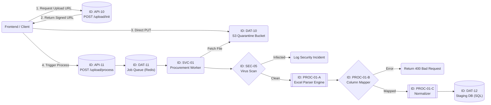

# Specification: PROC-01 (File Ingestion API)

| **Document ID** | **Version** | **Status** | **Owner (Author)** | **Approved By** |
| :--- | :--- | :--- | :--- | :--- |
| PROC-01 | 1.0.0 | **DRAFT** | Business Architect | Product Officer |


## 1. The Strategy: "Async Import Pattern"
To handle large Procurement Ledgers (50,000+ rows) without connection timeouts, we utilize an asynchronous **Presigned URL Pattern**:
1.  **Client** requests permission to upload.
2.  **API** validates permissions and returns a temporary, secure "Signed URL" (S3/Blob).
3.  **Client** uploads the file directly to object storage (bypassing the API server).
4.  **Client** calls the `process` endpoint to trigger the worker.

## 2. The Data Contract (Target Schema)
The parser must normalize incoming Excel/CSV data into this strict JSON structure for consumption by `PROC-02` (Validator).

```json
{
  "batch_id": "proc-2025-11-29-001",
  "entity_id": "ent_us_HQ",
  "reporting_period": "2024-Q3",
  "currency_default": "USD",
  "line_items": [
    {
      "row_index": 1,
      "date": "2024-09-15",
      "vendor_name": "Amazon Web Services",
      "vendor_id": "V-9920",
      "gl_code": "5100-SOFTWARE",
      "description": "Cloud Hosting Fees - Sept",
      "amount_gross": 1200.00,
      "amount_net": 1000.00,
      "tax_amount": 200.00,
      "currency": "USD"
    }
  ]
}
```
## 3. API Specification (OpenAPI Summary)

### Endpoint A: Initialize Upload
* **Method:** `POST /api/v1/procurement/upload/init`
* **Purpose:** Security check, file hash verification, and storage allocation.
* **Payload:**
    ```json
    {
      "filename": "Q3_Ledger.xlsx",
      "file_size_bytes": 4500000,
      "file_hash": "sha256:9f86d081884c7d..."
    }
    ```
* **Response:**
    ```json
    {
      "upload_id": "up_12345",
      "signed_url": "[https://s3.aws.com/my-bucket/up_12345?signature=xyz](https://s3.aws.com/my-bucket/up_12345?signature=xyz)...",
      "expires_in": 300
    }
    ```

### Endpoint B: Trigger Processing
* **Method:** `POST /api/v1/procurement/upload/{upload_id}/process`
* **Purpose:** Triggers the background worker. Includes column mapping configuration.
* **Payload:**
    ```json
    {
      "mapping_config": {
        "date_column": "Invoice Date",
        "vendor_column": "Supplier",
        "amount_column": "Total Spend",
        "currency_column": "Curr",
        "skip_rows": 2
      }
    }
    ```
* **Response:** `202 Accepted`

### Endpoint C: Check Status
* **Method:** `GET /api/v1/procurement/upload/{upload_id}/status`
* **Response:**
    ```json
    {
      "status": "PROCESSING",
      "progress": 45,
      "errors": []
    }
    ```

## 4. Internal Workflow Logic
*The following diagram details the asynchronous handling of the file once the upload is initiated.*


---
## 5. Managing "Column Mapping" Strategy
To handle varying client Excel formats, the `POST /process` endpoint accepts a `mapping_config` object. The Parser Engine uses this to alias user columns to our internal schema.

**Mapping Logic:**
* **Read Headers:** The worker reads the specific row index defined in `skip_rows`.
* **Apply Map:** `df.rename(columns=mapping_config)`
* **Strict Typing:**
    * `date_column` -> Coerced to `ISO 8601 (YYYY-MM-DD)`.
    * `amount_column` -> Coerced to `Decimal(10, 2)`.
    * `currency_column` -> Validated against ISO 4217 list (USD, EUR, GBP).

## 6. Audit & Quality Checkpoints (ISO 9001)
To satisfy functional suitability and security requirements:

| ID | Control Requirement | Implementation Logic |
| :--- | :--- | :--- |
| **QC-01** | **Integrity Verification** | The Worker must compare the SHA-256 hash of the downloaded file against the hash provided in the `Init` request. Mismatches must trigger a `409 Conflict`. |
| **QC-02** | **Sanitization** | The Parser must explicitly strip Excel formulas (starting with `=`) and macros to prevent CSV Injection or Remote Code Execution. |
| **QC-03** | **Error Granularity** | Validation failures must return the specific **Row Number** and **Column Name** (e.g., *"Row 14: Invalid Date Format"*). Generic "Upload Failed" messages are non-compliant. |
