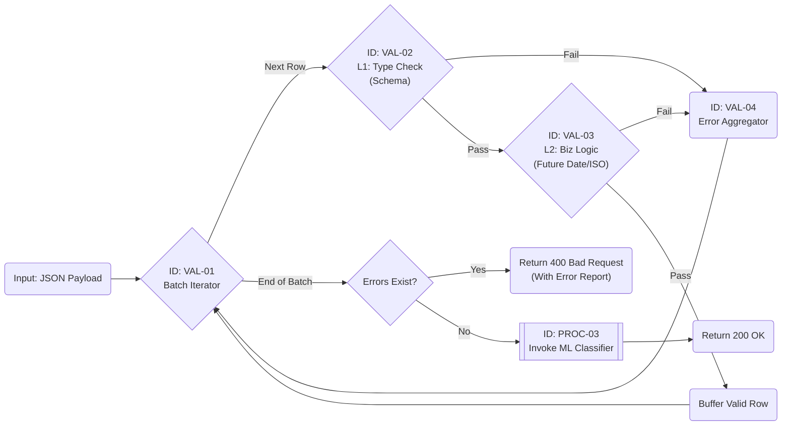

# Specification: PROC-02 (Data Validator)

| **Document ID** | **Version** | **Status** | **Owner (Author)** | **Approved By** |
| :--- | :--- | :--- | :--- | :--- |
| PROC-02 | 1.0.0 | **DRAFT** | Business Architect | Product Officer |

## 1. Description & Scope
The **Data Validator** receives the normalized JSON payload from the parser (`PROC-01`). Its job is to enforce **Structural Integrity** (Schema) and **Business Logic** (Sanity Checks) before any data touches the calculation engines.

**Strategic Choice: "Collect All Errors" Pattern**
Unlike standard APIs that fail on the first error, `PROC-02` iterates through the *entire* batch (up to 50k rows) and returns a consolidated report. This allows the user to fix 50 typos in one go, rather than uploading 50 times.

## 2. Validation Matrix (The Rules)
The service applies three layers of validation tests:

| Layer | Check | Rule Description | Severity |
| :--- | :--- | :--- | :--- |
| **L1** | **Structure** | `date`, `amount`, `currency` must not be null/empty. | **BLOCKER** |
| **L1** | **Types** | `amount` must be a valid number (decimal). | **BLOCKER** |
| **L2** | **Reference** | `currency` must match standard ISO 4217 list (USD, EUR, etc.). | **BLOCKER** |
| **L2** | **Logic** | `date` cannot be in the future (Time Traveler check). | **WARNING** |
| **L3** | **Context** | `gl_code` should match the format expected for this Entity (optional). | **WARNING** |

## 3. The Error Data Contract
If validation fails, the service returns this specific JSON structure. This drives the "Fix It" UI grid on the frontend.

```json
{
  "status": "VALIDATION_FAILED",
  "batch_id": "proc-2025-11-29-001",
  "error_count": 2,
  "blocking_errors": true,
  "report": [
    {
      "row_index": 14,
      "field": "currency",
      "value": "US Dollar",
      "error_code": "ERR_ISO_CURRENCY",
      "message": "Invalid format. Expected ISO Code (e.g. 'USD')."
    },
    {
      "row_index": 22,
      "field": "amount_net",
      "value": "-500.00",
      "error_code": "WRN_NEGATIVE_SPEND",
      "message": "Negative spend detected. Verify if this is a refund."
    }
  ]
}
```

## 4. Internal Workflow Logic
This diagram illustrates the "Collect All" loop that segregates valid rows from invalid rows.

### Component Dictionary (Internal Logic)
The following internal functions are isolated for unit testing purposes:

| Component ID | Name | Technical Description | Test Case Reference |
| :--- | :--- | :--- | :--- |
| **VAL-01** | **Batch Iterator** | A generator function that streams rows one by one to prevent memory overflows when processing large files (>50MB). | `TC-VAL-001 (Memory Load)` |
| **VAL-02** | **L1 Schema Check** | Enforces strict type safety. It validates that "Amounts" are `Decimal` (not Strings) and dates follow `ISO-8601`. Nulls in mandatory fields trigger immediate failure. | `TC-VAL-005 (Null Handling)` |
| **VAL-03** | **L2 Business Logic** | Contextual validation rules. <br>1. **Future Date:** Reject if `Date > Today`.<br>2. **Currency:** Validate against `ISO-4217` allow-list.<br>3. **Negative Spend:** Flag as Warning (Potential Refund). | `TC-VAL-010 (Future Dates)` |
| **VAL-04** | **Error Aggregator** | A structured buffer that collects error objects `{row, field, message}` without stopping the iteration, enabling a "fix-all-at-once" user experience. | `TC-VAL-015 (Error Reporting)` |
---
## 5. Audit & Quality Checkpoints (ISO 9001)

| ID | Control Requirement | Implementation Logic |
| :--- | :--- | :--- |
| **QC-VAL-01** | **Negative Value Handling** | Carbon Accounting math breaks with negative numbers (Refunds). `PROC-02` must flag negative numbers as **Warnings** so the user can confirm if it's a credit note or a typo. |
| **QC-VAL-02** | **Duplicate Detection** | The system must check a hash of the row (Date + Vendor + Amount) against previously uploaded lines to prevent double counting emissions. |
| **QC-VAL-03** | **Zero-Value Filtering** | Rows with `0.00` spend create noise in the database. `PROC-02` should silently drop them or flag them as "Ignored" in the audit log. |