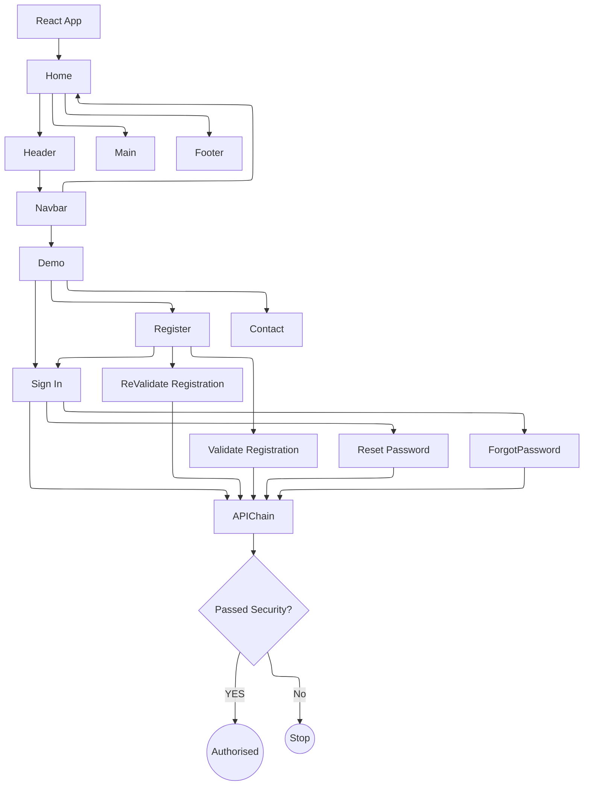

# Sustina Platform – Workflows #0001 REGISTRATION
Below is the most recent version of the DEMO functionality in readienss for the CAB.

```mermaid
---
config:
  layout: elk
---
flowchart TB
    ReactApp["React App"] --> Home["Home"]
    Home --> Header["Header"] & Main["Main"] & Footer["Footer"]
    Header --> Navbar["Navbar"]
    Navbar --> Home & Demo["Demo"]
    Demo --> SignIn["Sign In"] & Register["Register"] & Contact
    Register --> SignIn & ValidateReg["Validate Registration"] & ResendValidation["ReValidate Registration"]
    SignIn --> ResetPassword["Reset Password"]
    SignIn --> ForgotPassword
    SignIn --> APIChain
    ValidateReg--> APIChain
    ResetPassword --> APIChain
    ForgotPassword --> APIChain
    ResendValidation --> APIChain
    APIChain -->AuthOK{"Passed Security?"}
    AuthOK -->|YES| circleId(("`Authorised`"))
    AuthOK -->|No| circleId2(("`Stop`"))
```
