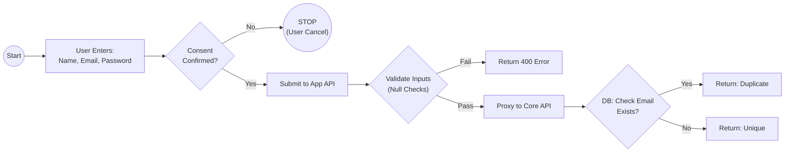
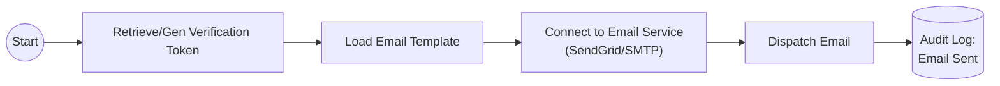
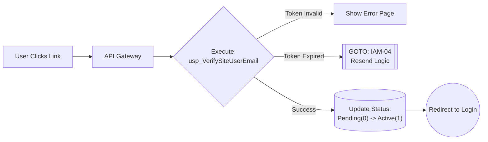
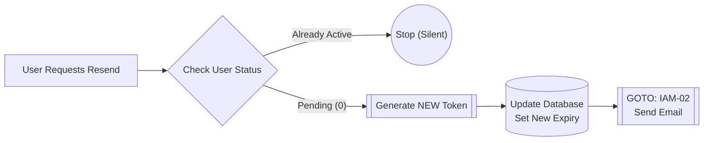
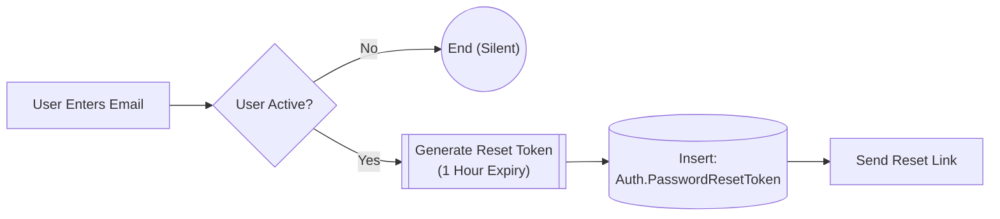
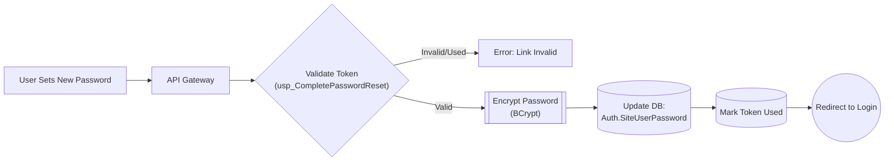

```mermaid
flowchart LR
    %% UI LAYER
    WEB["React App"] --> NAV{"User Action"}
    
    NAV -- "New User" --> R_START((Start))
    NAV -- "Existing User" --> L_START((Start))

    %% ==========================================
    %% STREAM 1: REGISTRATION (The Onboarding Loop)
    %% ==========================================
    %% STEP 1: INPUT & CHECK
    R_START --> SUB_REG[["REF: IAM-01<br/>Register New User"]]
    
    SUB_REG --> API_REG["API: Check Uniqueness"]
    API_REG --> CHECK_UNIQ{"Is Unique?"}
    
    %% STOP 1: REGISTRATION FAILURE
    CHECK_UNIQ -- "No (Duplicate)" --> ERR_DUP["Error: User Already Exists"]
    ERR_DUP --> STOP_REG((("`**STOP**<br/>(Reg Failed)`")))

    %% STEP 2: CREATE & SEND
    CHECK_UNIQ -- "Yes" --> CREATE["Create 'Pending' Account"]
    CREATE --> SUB_SEND[["REF: IAM-02<br/>Send Validation Email"]]
    
    %% STEP 3: VALIDATION
    SUB_SEND --> WAIT_VAL{"User Clicks Link?"}
    
    WAIT_VAL -- Yes --> SUB_VAL[["REF: IAM-03<br/>Verify User Token"]]
    WAIT_VAL -- Expired --> SUB_REVAL[["REF: IAM-04<br/>Resend Validation"]]
    
    SUB_REVAL --> SUB_SEND
    
    SUB_VAL --> R_END((Ready))

    %% ==========================================
    %% STREAM 2: AUTHENTICATION (The Login Loop)
    %% ==========================================
    L_START --> L_DEC{"Decision"}
    
    L_DEC -- "Sign In" --> INPUT["Enter Credentials"]
    L_DEC -- "Forgot Password" --> SUB_REC[["REF: IAM-05/06<br/>Recovery Flow"]]
    
    INPUT & SUB_REC --> API_AUTH["API: Verify Credentials"]
    
    API_AUTH --> CHECK_AUTH{"Credentials<br/>Valid?"}

    %% STOP 2: LOGIN FAILURE
    CHECK_AUTH -- "No" --> ERR_LOGIN["Error: Invalid / Suspended"]
    ERR_LOGIN --> STOP_AUTH((("`**STOP**<br/>(Access Denied)`")))

    %% FINAL SUCCESS STATE
    CHECK_AUTH -- "Yes" --> AUTH_OK((("`**AUTHORIZED**`")))
    
    %% LINK: Newly Ready users can now login
    R_END -.-> INPUT
```

# Sustina Platform: Security & Identity Overview: M-002 (Registration & Authentication)

This document outlines the security protocols the Sustina Platform uses to manage user identities. Our system utilizes a secure, multi-stage verification process (Double Opt-In) to ensure data integrity and compliance.
---
# Workflow Reference: M-002 (Registration & Authentication)

**Description:**
This workflow outlines the user entry point into the Sustina Platform. It maps the critical security flows managed by the React App frontend and the connecting API Gateway.

Unlike a simple component tree, this flow focuses on the **State Transitions** required to move a user from "Guest" to "Authorized" status. It isolates complex security procedures (like Token Validation and Password Recovery) into dedicated sub-routines to ensure auditability and security compliance.

### Key Logical Steps

1.  **Entry Routing (React App):**
    The user lands on the application via the UI Layer. The Navigation logic determines if they are initiating a new session (**Login**) or a new relationship (**Register**).

2.  **Registration Cycle (The "User" Loop):**
    * **IAM-01 (Register):** Creates the provisional "Pending" user account.
    * **IAM-06 (Delivery):** Handles the secure dispatch of the verification email.
    * **IAM-02 (Validation):** The user clicks the link, and the system verifies the token to activate the account.
    * **IAM-03 (Retry):** If validation fails or expires, this subroutine regenerates the token and routes back to **IAM-06** to resend it.

3.  **Recovery Cycle:**
    If a user cannot sign in, they are routed to a distinct loop for **Forgot/Reset Password** (`IAM-04` & `IAM-05`), which operates independently of the main login flow to prevent security bypassing.

4.  **The "API Chain" & Authorization:**
    All paths converge on the **Security Gate**. This is the final decision point where the API Gateway validates the payload and issues a JWT (JSON Web Token) or rejects the request.

### Process Flow Diagram

# Workflow Reference: IAM-01 (Register New User)

**Description:**
This subroutine handles the initial creation of a user account. It follows a **Facade Pattern** where the public-facing App API receives the request, validates the structure, and then securely proxies the data to the Core API for processing, hashing, and storage.

### Key Logical Steps

1.  **Client Request (React App):**
    The user submits their Email and Password via the registration form to the endpoint `POST /api/app/register`.

2.  **Edge Validation (App API):**
    The `AuthEndpoints.cs` class receives the request. It performs a "Sanity Check" to ensure fields are not null or empty.
    * *Failure:* Returns `400 Bad Request` immediately (protecting the Core API from bad traffic).
    * *Success:* Proceeds to proxy the request.

3.  **Secure Proxy (Core API Hand-off):**
    The request is forwarded over a secure channel to the Core API endpoint `api/auth/register`.

4.  **Core Processing (The "Heavy Lifting"):**
    The Core API is responsible for the secure business logic:
    * **Duplicate Check:** Verifies the email doesn't already exist in the DB.
    * **Security:** Hashes the password (e.g., BCrypt) so plain text is never stored.
    * **Storage:** Executes the stored procedure `usp_RegisterSiteUser`.
    * **Verification:** Triggers the verification email (handing off to `IAM-02`).

### Process Flow Diagram

# Workflow Reference: IAM-01 (Register New User)

**Description:**

# Workflow Reference: IAM-02 (Send Validation Email)

**Description:**
Description: A dedicated utility workflow that handles the secure dispatch of the verification email. It is called immediately after registration (IAM-01) or during a resend request (IAM-04).
### Process Flow Diagram

# Workflow Reference: IAM-03 (Verify User Token)

**Description:**
Description: The "Handshake" moment. The user clicks the link in their email. The system validates the token against the database and activates the account.04).
### Process Flow Diagram

# Workflow Reference: IAM-04 (Resend Validation)

**Description:**
Description: The "Retry" loop. If a token expires or the email is lost, this generates a new token (resetting the 24-hour clock) and calls IAM-02 to send it.
### Process Flow Diagram

# Workflow Reference: IAM-05 (Initiate Password Reset)

**Description:**
Description: The first step of recovery. Checks if the email exists and generates a short-lived (1 hour) reset token.
### Process Flow Diagram

# Workflow Reference: IAM-06 (Complete Password Reset)

**Description:**
Description: The final step of recovery. Validates the reset token and updates the password hash in the database.
### Process Flow Diagram

