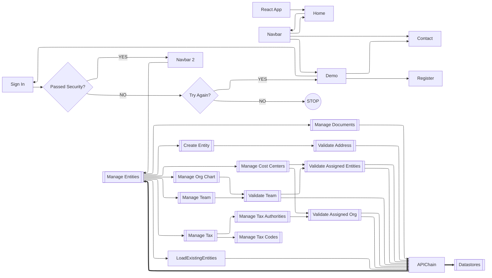

# Sustina Platform – WorkFlow #0002 MANAGE ENTITIES 
Below is the most recent version of the DEMO functionality in readienss for the CAB.

```mermaid
---
config:
  layout: elk
---
flowchart LR
    ReactApp["React App"] --> Home["Home"]
    Home --> Navbar
    Navbar --> Home & Demo["Demo"] & Contact["Contact"]
    Demo --> SignIn["Sign In"] & Register["Register"] & Contact
    SignIn --> AuthOK{"Passed Security?"}
    AuthOK -->|YES| Navbar2["Navbar 2"]
    AuthOK -->|NO| TRYAGAIN{"Try Again?"}
    TRYAGAIN -->|YES| Demo
    TRYAGAIN -->|NO| circleId(("`STOP`"))
    Navbar2 --> ManageEntities[["`Manage Entities`"]] --> CreateEntity[["`Create Entity`"]] & ManageOrgChart[["`Manage Org Chart`"]] & ManageTeam[["`Manage Team`"]] & ManageDocuments[["`Manage Documents`"]] & ManageCostCenters[["`Manage Cost Centers`"]] & ManageTax[["`Manage Tax`"]]
    dbId[["`Datastores`"]]
    CreateEntity --> ValidateAddress[["`Validate Address`"]] --> APIChain
    ManageCostCenters --> ValidateEntities[["`Validate Assigned Entities`"]] & ValidateFunction[["`Validate Assigned Org`"]] --> APIChain
    ManageTeam --> ValidateTeam[["`Validate Team`"]] --> APIChain
    ManageOrgChart --> ValidateTeam
    ValidateTeam --> ValidateEntities --> APIChain
    ManageTax --> ManageTaxDates[["`Manage Tax Authorities`"]] & ManageTaxStandard[["`Manage Tax Codes`"]]
    ManageTaxDates --> ValidateFunction --> APIChain
    ManageDocuments --> APIChain
    APIChain ==> dbId
    LoadExistingEntities --> APIChain
    ManageEntities --> LoadExistingEntities
    APIChain ==> ManageEntities
```

