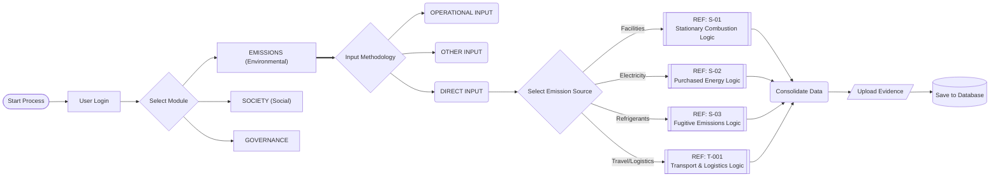
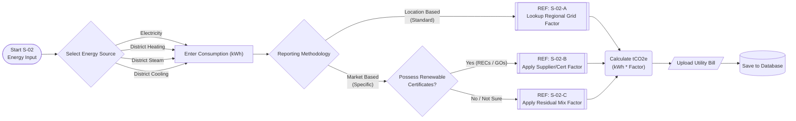
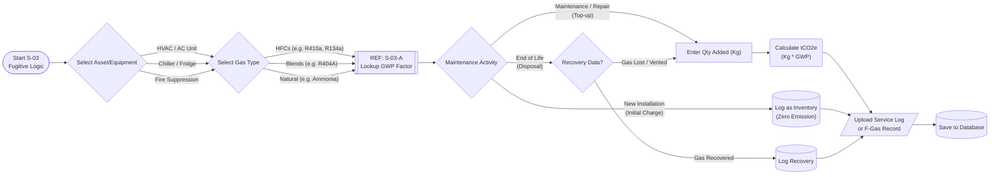
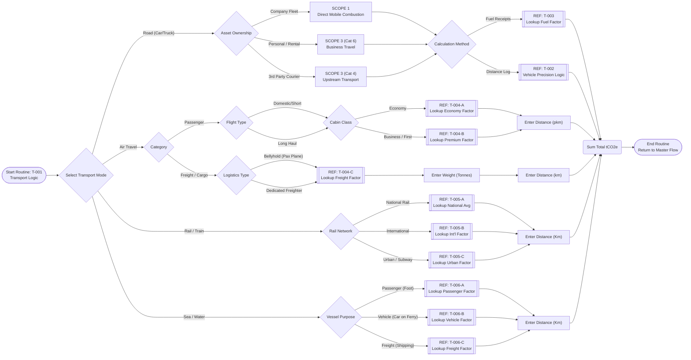

# Sustina Platform – Workflow Reference: M-001 (Master Emissions Flow)

**Description:**
This is the high-level "Orchestrator" view of the Sustina Platform. It governs the user journey from Login through to the specific ESG module selection.

Its primary function is **routing**. It distinguishes between the three ESG pillars (Environmental, Social, Governance) and further segregates the Environmental inputs into specific data streams. Rather than calculating data directly, this flow delegates logic to specific sub-routines (e.g., `T-001`, `S-01`) to maintain system architecture clarity.

### Key Logical Steps

1.  **Module Selection:**
    After authentication, the user selects the primary reporting pillar. This flow details the **Environmental (Emissions)** path.

2.  **Input Methodology:**
    Determines the data source:
    * **Direct Input:** Manual entry (handled in this flow's sub-routines).
    * **Operational Input:** Automated API/IoT ingestion (handled in parallel flows).

3.  **Sub-Routine Delegation:**
    For Direct Inputs, the system routes the user to specific calculation logic blocks:
    * **REF S-01 (Facilities):** Stationary combustion (Boilers/Generators).
    * **REF S-02 (Energy):** Purchased Electricity/Heating.
    * **REF S-03 (Fugitive):** Refrigerant gas leaks.
    * **REF T-001 (Transport):** Mobile combustion and logistics.

4.  **Data Consolidation:**
    All sub-routines return calculated data to this master flow for final aggregation, evidence attachment, and database commitment.

**M-001 (Master Emissions Flow) schematic:**

# Workflow Reference: S-01 (Stationary Combustion Logic)

**Description:**
This workflow calculates **Scope 1 Direct Emissions** from fuel burned in fixed assets owned or controlled by the reporting entity. This includes boilers, furnaces, turbines, heaters, and incinerators.

### Key Logical Steps

1.  **Asset Identification:**
    The user links the consumption to a specific asset (e.g., "Building A Backup Generator"). This is crucial for asset-level carbon accounting.

2.  **Fuel State Logic:**
    Unlike vehicles, stationary fuels vary wildly in physical state. The logic splits into three branches:
    * **Liquid:** (Diesel, Residual Fuel Oil, LPG) - Measured in Liters/Gallons.
    * **Solid:** (Coal, Wood Pellets, Biomass) - Measured in Mass (kg/Tonnes).
    * **Gas:** (Natural Gas, Biogas) - Measured in Volume (m³) or Energy (kWh/Therms).

3.  **Bio-Energy Check:**
    If the fuel is flagged as "Biomass" or "Biogas," the system must apply specific "Outside of Scopes" factors for the biogenic CO2 portion, separate from the fossil portion.

4.  **Sub-Routine Delegation:**
    Emission factor lookups are delegated to state-specific sub-routines (`S-01-A` to `S-01-C`) to handle the specific unit conversions (e.g., Gross vs. Net Calorific Value for gas).

### Process Flow Diagram

```mermaid
flowchart LR
    %% START
    START(["Start S-01<br/>Stationary Combustion"]) --> ASSET{"Select Asset"}
    
    ASSET -- "Generator / Engine" --> FUEL_CAT{"Select Fuel State"}
    ASSET -- "Boiler / Furnace" --> FUEL_CAT
    ASSET -- "CHP / Turbine" --> FUEL_CAT

    %% ==========================================
    %% BRANCH 1: LIQUID FUELS (Diesel, Oil)
    %% ==========================================
    FUEL_CAT -- "Liquid Fuel" --> LIQ_TYPE["Select Type<br/>(Diesel, Gas Oil, LPG)"]
    
    LIQ_TYPE --> SUB_LIQ[["REF: S-01-A<br/>Lookup Liquid Factor"]]
    
    SUB_LIQ --> LIQ_QTY["Enter Volume"]
    LIQ_QTY --> LIQ_UNIT{"Unit"}
    LIQ_UNIT -- "Litres" --> CALC_SUM
    LIQ_UNIT -- "Gallons (US/UK)" --> CALC_SUM

    %% ==========================================
    %% BRANCH 2: SOLID FUELS (Coal, Biomass)
    %% ==========================================
    FUEL_CAT -- "Solid Fuel" --> SOL_TYPE["Select Type<br/>(Coal, Wood, Peat)"]
    
    SOL_TYPE --> SUB_SOL[["REF: S-01-B<br/>Lookup Solid Factor"]]
    
    SUB_SOL --> SOL_QTY["Enter Mass"]
    SOL_QTY --> SOL_UNIT{"Unit"}
    SOL_UNIT -- "Metric Tonnes" --> CALC_SUM
    SOL_UNIT -- "Kg / Lbs" --> CALC_SUM

    %% ==========================================
    %% BRANCH 3: GASEOUS FUELS (Nat Gas, LNG)
    %% ==========================================
    FUEL_CAT -- "Gaseous Fuel" --> GAS_TYPE["Select Type<br/>(Natural Gas, LNG, Biogas)"]
    
    GAS_TYPE --> SUB_GAS[["REF: S-01-C<br/>Lookup Gas Factor"]]
    
    SUB_GAS --> GAS_QTY["Enter Amount"]
    GAS_QTY --> GAS_UNIT{"Unit"}
    
    %% Gas often needs CV conversion
    GAS_UNIT -- "Volume (m3 / ft3)" --> GAS_CV[["REF: S-01-D<br/>Convert Volume to Energy"]]
    GAS_UNIT -- "Energy (kWh / Therms)" --> CALC_SUM
    
    GAS_CV --> CALC_SUM

    %% ==========================================
    %% CONSOLIDATION
    %% ==========================================
    CALC_SUM("Calculate tCO2e") --> EVIDENCE[/"Upload Meter Read<br/>or Invoice"/]
    
    EVIDENCE --> SAVE[("Save to Database")]
```

# Workflow Reference: S-02 (Purchased Energy Logic)

**Description:**
This workflow governs the calculation of **Scope 2 Indirect Emissions** (purchased electricity, heat, steam, and cooling). It is designed to comply with the **GHG Protocol Scope 2 Guidance**, which requires companies to account for emissions using two distinct methodologies: **Location-Based** and **Market-Based**.

### Key Logical Steps

1.  **Source Selection:**
    Identifies the utility type (Electricity, District Heating, Steam, or Cooling). This determines which emission factor database to query.

2.  **Methodology Decision:**
    The system enforces the "Dual Reporting" standard:
    * **Location-Based:** Uses average grid emission factors for the physical location.
    * **Market-Based:** Reflects the company's specific procurement choices (e.g., green tariffs).

3.  **Certificate Validation (The "Green Check"):**
    If a user selects "Market-Based," the system verifies if they possess **Energy Attribute Certificates** (RECs, GOs, I-RECs). Without proof, the system forces a fallback to the "Residual Mix" to prevent double-counting of green energy.

4.  **Sub-Routine Delegation:**
    Data lookup is delegated to specific sub-processes:
    * **REF S-02-A:** Lookups for standard Regional Grid Averages (e.g., eGRID, DEFRA).
    * **REF S-02-B:** Validation of Supplier Specific Rates and Certificates.
    * **REF S-02-C:** Lookups for Residual Mix Factors (for uncertified energy in a market-based scenario).

### Process Flow Diagram

# Workflow Reference: S-03 (Fugitive Emissions Logic)

**Description:**
This workflow calculates **Scope 1 Fugitive Emissions**, primarily from leaks in refrigeration and air conditioning equipment. This includes HVAC systems, chillers, industrial cooling, and fire suppression systems.

Unlike combustion, this calculation relies on **Global Warming Potential (GWP)** values. A single kilogram of refrigerant gas (e.g., R404A) can have the same warming impact as 3,922 kg of CO2, making accurate reporting critical.

### Key Logical Steps

1.  **Equipment Identification:**
    Links the emission to a specific asset (e.g., "Server Room AC Unit 1"). This builds an asset register required for audit trails.

2.  **Gas Identification (GWP Lookup):**
    The user must select the specific blend (e.g., R410a, R32, R134a).
    * *System Action:* The system calls Subroutine `S-03-A` to retrieve the specific IPCC GWP factor for that gas.

3.  **Activity Logic (The "Leak Check"):**
    The system distinguishes between:
    * **New Installation:** The gas added is "Stock," not an emission (unless leaks occur during install).
    * **Maintenance / Top-up:** Gas added to replace what was lost. **This is the emission.**
    * **Disposal:** Gas recovered vs. Gas lost at end-of-life.

4.  **Calculation:**
    Formula: $Mass (kg) \times GWP = tCO2e$.

### Process Flow Diagram

# Workflow Reference: T-001 (Transport & Logistics)

**Description:**
This subroutine handles the complex logic for Mobile Combustion (Scope 1) and Mobile Business Travel/Upstream Transport (Scope 3). It segregates emissions based on the **Transport Mode** and the **Asset Ownership** model.

### Key Logical Steps

1.  **Mode Selection:**
    Splits logic between Road, Air, Rail, and Sea.

2.  **Scope Determination:**
    * **Scope 1:** Applied only when the vehicle is **Company Owned/Leased**.
    * **Scope 3:** Applied to Personal Cars (Grey Fleet), Rentals, Flights, Trains, and 3rd Party Logistics (Couriers).

3.  **Sub-Routine Call (T-002):**
    For Road transport using **Distance**, the system calls a sub-routine (`T-002`) to handle precise license plate lookups and vehicle databases.

4.  **Cabin Class (Air):**
    Applies "Radiative Forcing" multipliers based on seat class (Economy vs. Business/First).

---

### Process Flow Diagram

]
