# Workflow Reference: S-01 (Stationary Combustion Logic)

**Description:**
This workflow calculates **Scope 1 Direct Emissions** from fuel burned in fixed assets owned or controlled by the reporting entity. This includes boilers, furnaces, turbines, heaters, and incinerators.

### Key Logical Steps

1.  **Asset Identification:**
    The user links the consumption to a specific asset (e.g., "Building A Backup Generator"). This is crucial for asset-level carbon accounting.

2.  **Fuel State Logic:**
    Unlike vehicles, stationary fuels vary wildly in physical state. The logic splits into three branches:
    * **Liquid:** (Diesel, Residual Fuel Oil, LPG) - Measured in Liters/Gallons.
    * **Solid:** (Coal, Wood Pellets, Biomass) - Measured in Mass (kg/Tonnes).
    * **Gas:** (Natural Gas, Biogas) - Measured in Volume (m³) or Energy (kWh/Therms).

3.  **Bio-Energy Check:**
    If the fuel is flagged as "Biomass" or "Biogas," the system must apply specific "Outside of Scopes" factors for the biogenic CO2 portion, separate from the fossil portion.

4.  **Sub-Routine Delegation:**
    Emission factor lookups are delegated to state-specific sub-routines (`S-01-A` to `S-01-C`) to handle the specific unit conversions (e.g., Gross vs. Net Calorific Value for gas).

### Process Flow Diagram

```mermaid
flowchart LR
    %% START
    START(["Start S-01<br/>Stationary Combustion"]) --> ASSET{"Select Asset"}
    
    ASSET -- "Generator / Engine" --> FUEL_CAT{"Select Fuel State"}
    ASSET -- "Boiler / Furnace" --> FUEL_CAT
    ASSET -- "CHP / Turbine" --> FUEL_CAT

    %% ==========================================
    %% BRANCH 1: LIQUID FUELS (Diesel, Oil)
    %% ==========================================
    FUEL_CAT -- "Liquid Fuel" --> LIQ_TYPE["Select Type<br/>(Diesel, Gas Oil, LPG)"]
    
    LIQ_TYPE --> SUB_LIQ[["REF: S-01-A<br/>Lookup Liquid Factor"]]
    
    SUB_LIQ --> LIQ_QTY["Enter Volume"]
    LIQ_QTY --> LIQ_UNIT{"Unit"}
    LIQ_UNIT -- "Litres" --> CALC_SUM
    LIQ_UNIT -- "Gallons (US/UK)" --> CALC_SUM

    %% ==========================================
    %% BRANCH 2: SOLID FUELS (Coal, Biomass)
    %% ==========================================
    FUEL_CAT -- "Solid Fuel" --> SOL_TYPE["Select Type<br/>(Coal, Wood, Peat)"]
    
    SOL_TYPE --> SUB_SOL[["REF: S-01-B<br/>Lookup Solid Factor"]]
    
    SUB_SOL --> SOL_QTY["Enter Mass"]
    SOL_QTY --> SOL_UNIT{"Unit"}
    SOL_UNIT -- "Metric Tonnes" --> CALC_SUM
    SOL_UNIT -- "Kg / Lbs" --> CALC_SUM

    %% ==========================================
    %% BRANCH 3: GASEOUS FUELS (Nat Gas, LNG)
    %% ==========================================
    FUEL_CAT -- "Gaseous Fuel" --> GAS_TYPE["Select Type<br/>(Natural Gas, LNG, Biogas)"]
    
    GAS_TYPE --> SUB_GAS[["REF: S-01-C<br/>Lookup Gas Factor"]]
    
    SUB_GAS --> GAS_QTY["Enter Amount"]
    GAS_QTY --> GAS_UNIT{"Unit"}
    
    %% Gas often needs CV conversion
    GAS_UNIT -- "Volume (m3 / ft3)" --> GAS_CV[["REF: S-01-D<br/>Convert Volume to Energy"]]
    GAS_UNIT -- "Energy (kWh / Therms)" --> CALC_SUM
    
    GAS_CV --> CALC_SUM

    %% ==========================================
    %% CONSOLIDATION
    %% ==========================================
    CALC_SUM("Calculate tCO2e") --> EVIDENCE[/"Upload Meter Read<br/>or Invoice"/]
    
    EVIDENCE --> SAVE[("Save to Database")]
```

