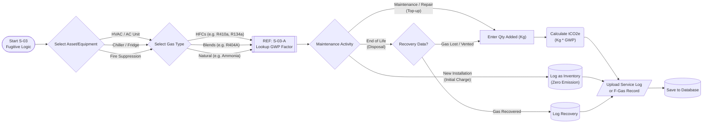

# Workflow Reference: S-03 (Fugitive Emissions Logic)

**Description:**
This workflow calculates **Scope 1 Fugitive Emissions**, primarily from leaks in refrigeration and air conditioning equipment. This includes HVAC systems, chillers, industrial cooling, and fire suppression systems.

Unlike combustion, this calculation relies on **Global Warming Potential (GWP)** values. A single kilogram of refrigerant gas (e.g., R404A) can have the same warming impact as 3,922 kg of CO2, making accurate reporting critical.

### Key Logical Steps

1.  **Equipment Identification:**
    Links the emission to a specific asset (e.g., "Server Room AC Unit 1"). This builds an asset register required for audit trails.

2.  **Gas Identification (GWP Lookup):**
    The user must select the specific blend (e.g., R410a, R32, R134a).
    * *System Action:* The system calls Subroutine `S-03-A` to retrieve the specific IPCC GWP factor for that gas.

3.  **Activity Logic (The "Leak Check"):**
    The system distinguishes between:
    * **New Installation:** The gas added is "Stock," not an emission (unless leaks occur during install).
    * **Maintenance / Top-up:** Gas added to replace what was lost. **This is the emission.**
    * **Disposal:** Gas recovered vs. Gas lost at end-of-life.

4.  **Calculation:**
    Formula: $Mass (kg) \times GWP = tCO2e$.

### Process Flow Diagram

